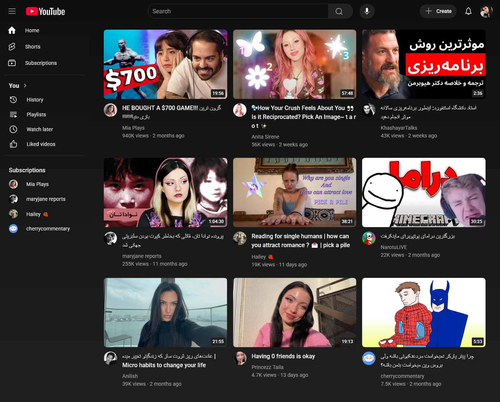

<h1 align="center">🎥 YouTube Clone</h1>

<p align="center">
  A YouTube clone built with <strong>HTML</strong> and <strong>CSS</strong> to replicate the basic functionality of the popular video-sharing platform.
</p>

<p align="center">
  <a href="https://github.com/zibaakord/youtube-clone"></a>
  <a href="#"></a>
</p>

---

## ℹ️ About This Project

This project is a **YouTube clone** created to practice building interactive web applications with **HTML** and **CSS**. The application mimics the look and feel of YouTube, featuring a video feed, search functionality, and navigation elements.

The primary goal of the project was to design a responsive and visually appealing user interface, similar to YouTube, using **HTML** and **CSS** without involving JavaScript.

---

## 🛠️ Built With

| Technology     | Purpose                |
|----------------|------------------------|
| `HTML5`        | Structure and markup   |
| `CSS3`         | Styling & layout       |

---

## 📷 Preview



---

## 📂 Getting Started

To view the project locally:

```bash
git clone https://github.com/zibaakord/youtube-clone.git
cd youtube-clone
open index.html
